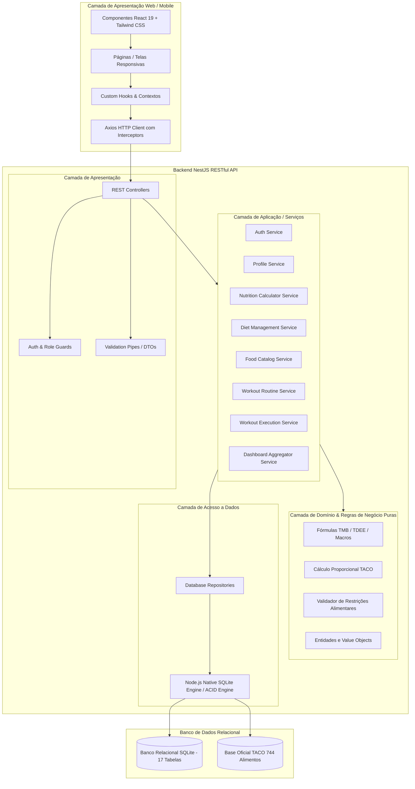
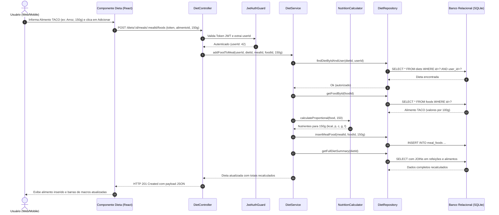

# DOCUMENTO DE ARQUITETURA DE SOFTWARE — NUTRIPLAN V2

**Projeto:** Sistema Web/Mobile de Montagem Personalizada de Dieta e Treino  
**Disciplina:** Engenharia de Software  
**Data:** Outubro de 2026  
**Padrão Arquitetural:** Arquitetura em Camadas (Layered Architecture) / Clean Architecture Orientada a Domínio  

---

## 1. VISÃO GERAL DA ARQUITETURA

O sistema foi concebido segundo os princípios de **Separação de Preocupações (Separation of Concerns)**, **Alta Coesão** e **Baixo Acoplamento**, garantindo que as regras de negócio de nutrição e treinamento permaneçam totalmente independentes de frameworks de interface gráfica, de transporte HTTP ou de detalhes de persistência.

---

## 2. DESCRIÇÃO DAS CAMADAS

### 2.1. Camada de Apresentação (Frontend)
- **Tecnologias:** React 19, TypeScript, Vite, Tailwind CSS v4, Lucide React, React Router v7.
- **Responsabilidade:** Renderização responsiva orientada a dispositivos móveis, tablets e desktops. Comunicação via chamadas RESTful assíncronas com tratamento de loading, erros amigáveis e feedback instantâneo. Nenhuma fórmula matemática de nutrição é acoplada rigidamente à UI; os dados são consumidos dos serviços.

### 2.2. Camada de Apresentação da API (Backend Controllers & Guards)
- **Tecnologias:** NestJS Controllers, Express Platform, JWT Guards.
- **Responsabilidade:** Receber requisições HTTP, extrair parâmetros, validar esquemas e tipos (DTOs), garantir que o cabeçalho de autenticação contenha um token válido e delegar a execução para a camada de serviços. Retornar status HTTP semanticamente corretos (200, 201, 400, 401, 403, 404, 409, 422, 500).

### 2.3. Camada de Aplicação (Application Services)
- **Responsabilidade:** Orquestrar fluxos de trabalho e casos de uso da aplicação: autenticar usuário, carregar refeições, registrar histórico, calcular metas e montar o resumo do dashboard. Conectar os repositórios às regras de domínio puras.

### 2.4. Camada de Domínio (Pure Business Logic)
- **Responsabilidade:** Contém as fórmulas científicas de gasto calórico (Mifflin-St Jeor), algoritmos de cálculo proporcional de nutrientes baseados na TACO, regras de conformidade alimentar (alergias/intolerâncias) e validações estruturais.
- **Independência:** Esta camada não possui dependências de NestJS, banco de dados ou bibliotecas externas. Ela pode ser testada em milissegundos através de testes unitários isolados.

### 2.5. Camada de Persistência e Repositórios (Data Access Layer)
- **Tecnologia:** Motor relacional nativo Node.js (`node:sqlite`) integrado à arquitetura de Repositórios.
- **Vantagens de Engenharia:**
  - Zero dependências nativas binárias ou complexidades de compilação;
  - Totalmente relacional: suporte a chaves primárias, chaves estrangeiras com `ON DELETE CASCADE`, restrições `CHECK`, `UNIQUE` e índices otimizados;
  - Suporte a transações ACID para atomicidade ao salvar planos complexos de dieta e registros de treino;
  - Portabilidade total para execução em ambientes de testes automatizados e integração contínua (CI).

---

## 3. PADRÕES DE PROJETO (DESIGN PATTERNS) APLICADOS

1. **Repository Pattern:** Desacopla a camada de aplicação da tecnologia de armazenamento, permitindo alternar de SQLite em memória durante testes para SQLite em disco em produção sem modificar os serviços.
2. **DTO (Data Transfer Object):** Validação estrita de contratos de entrada e saída na API, prevenindo injeção de parâmetros indesejados (*mass assignment*).
3. **Dependency Injection (DI):** Injeção de dependências nativa do NestJS garantindo baixo acoplamento e facilidade para mockar dependências em testes unitários.
4. **Strategy Pattern:** Utilizado nas estratégias de cálculo nutricional por objetivo (emagrecimento, hipertrofia, manutenção).
5. **Guard Pattern:** Validação de autenticação e propriedade de recursos em nível de rota antes da execução dos controladores.

---

## 4. FLUXO DE EXECUÇÃO: EXEMPLO DE ADIÇÃO DE ALIMENTO À DIETA

