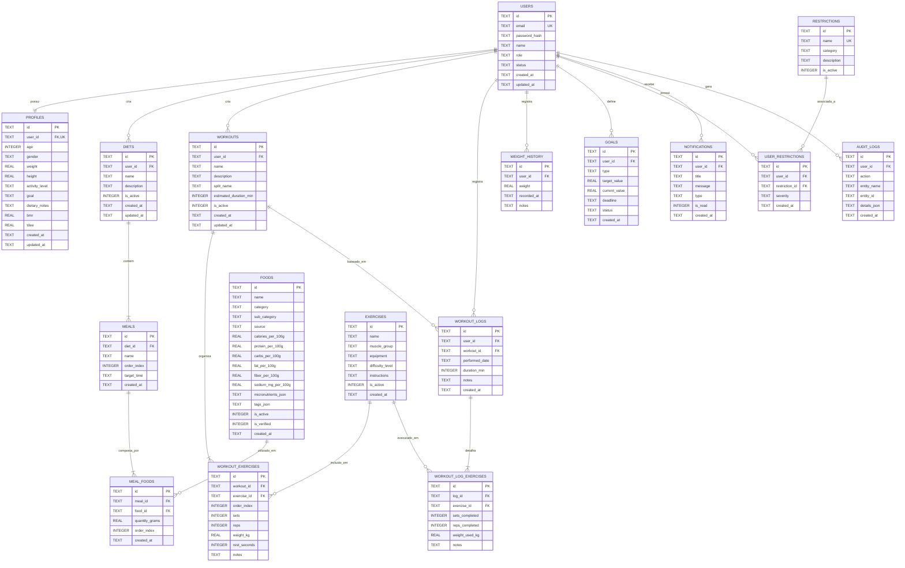

# MODELO DE BANCO DE DADOS RELACIONAL — NUTRIPLAN V2

**Projeto:** Sistema Web/Mobile de Montagem Personalizada de Dieta e Treino  
**Disciplina:** Engenharia de Software  
**Data:** Outubro de 2026  
**SGBD:** Banco de Dados Relacional SQLite com Suporte a Chaves Estrangeiras e Transações ACID  

---

## 1. DIAGRAMA ENTIDADE-RELACIONAMENTO (ERD)

---

## 2. ESPECIFICAÇÃO DETALHADA DAS TABELAS

### 2.1. Tabela `users`
- `id` (TEXT PRIMARY KEY) — Identificador único universal (UUID v4).
- `email` (TEXT UNIQUE NOT NULL) — E-mail em minúsculas e normalizado.
- `password_hash` (TEXT NOT NULL) — Hash criptográfico gerado com salt.
- `name` (TEXT NOT NULL) — Nome completo do usuário.
- `role` (TEXT DEFAULT 'USER') — Papel no sistema (`USER`, `ADMIN`).
- `status` (TEXT DEFAULT 'ACTIVE') — Status da conta (`ACTIVE`, `INACTIVE`, `BANNED`).
- `created_at` (TEXT NOT NULL) — Data/hora ISO 8601 de criação.
- `updated_at` (TEXT NOT NULL) — Data/hora ISO 8601 da última alteração.
*Índices:* `idx_users_email` em `email`.

### 2.2. Tabela `profiles`
- `id` (TEXT PRIMARY KEY) — UUID.
- `user_id` (TEXT UNIQUE NOT NULL, FK `users(id) ON DELETE CASCADE`).
- `age` (INTEGER) — Idade em anos (CHECK entre 10 e 120).
- `gender` (TEXT) — Sexo biológico (`MALE`, `FEMALE`).
- `weight` (REAL) — Peso corporal em quilogramas (CHECK entre 20 e 350).
- `height` (REAL) — Altura em centímetros (CHECK entre 50 e 250).
- `activity_level` (TEXT) — Nível de atividade (`SEDENTARY`, `LIGHTLY_ACTIVE`, etc.).
- `goal` (TEXT) — Objetivo (`LOSE_WEIGHT`, `MAINTAIN`, `GAIN_WEIGHT`).
- `dietary_notes` (TEXT) — Observações e preferências gerais.
- `bmr` (REAL) — Taxa metabólica basal calculada em kcal.
- `tdee` (REAL) — Gasto energético diário total em kcal.
- `created_at` (TEXT NOT NULL), `updated_at` (TEXT NOT NULL).
*Índices:* `idx_profiles_user_id` em `user_id`.

### 2.3. Tabela `restrictions` e `user_restrictions`
- `restrictions`: Catálogo de restrições (Lactose, Glúten, Frutos do mar, Soja, Vegano, Vegetariano).
- `user_restrictions`: Vínculo N:M entre usuário e restrição, com severidade (`INTOLERANCE`, `ALLERGY`, `PREFERENCE`).
*Índices:* `idx_user_rest_user` em `user_id`, `idx_user_rest_res` em `restriction_id`.

### 2.4. Tabela `foods`
- `id` (TEXT PRIMARY KEY) — Chave unívoca (ex.: `taco-1`, `custom-uuid`).
- `name` (TEXT NOT NULL) — Nome higienizado em linguagem natural do alimento.
- `category` (TEXT NOT NULL) — Categoria oficial TACO.
- `sub_category` (TEXT) — Subcategoria refinada (ex.: Carne bovina, Aves, Peixes).
- `source` (TEXT DEFAULT 'TACO') — Fonte de referência oficial.
- `calories_per_100g` (REAL NOT NULL) — Energia em quilocalorias por 100g.
- `protein_per_100g` (REAL NOT NULL) — Proteínas em gramas por 100g.
- `carbs_per_100g` (REAL NOT NULL) — Carboidratos em gramas por 100g.
- `fat_per_100g` (REAL NOT NULL) — Lipídios totais em gramas por 100g.
- `fiber_per_100g` (REAL NOT NULL) — Fibras alimentares em gramas por 100g.
- `sodium_mg_per_100g` (REAL) — Sódio em miligramas por 100g.
- `micronutrients_json` (TEXT) — Objeto JSON serializado com cálcio, ferro, potássio, etc.
- `tags_json` (TEXT) — Array JSON serializado com tags (`alto-proteina`, `zero-carb`, etc.).
- `is_active` (INTEGER DEFAULT 1), `is_verified` (INTEGER DEFAULT 1).
*Índices:* `idx_foods_name` em `name`, `idx_foods_category` em `category`.

### 2.5. Tabelas `diets`, `meals` e `meal_foods`
- `diets`: Guarda o plano do usuário (`user_id` FK, `name`, `is_active`).
- `meals`: Refeições associadas (`diet_id` FK `ON DELETE CASCADE`, `name`, `order_index`).
- `meal_foods`: Itens da refeição (`meal_id` FK `ON DELETE CASCADE`, `food_id` FK, `quantity_grams` CHECK > 0).
*Integridade:* A exclusão de uma refeição remove apenas seus itens; a exclusão da dieta remove todas as refeições e itens vinculados.
*Índices:* `idx_diets_user` em `user_id`, `idx_meals_diet` em `diet_id`, `idx_meal_foods_meal` em `meal_id`.

### 2.6. Tabelas `exercises`, `workouts` e `workout_exercises`
- `exercises`: Catálogo de exercícios (`name`, `muscle_group`, `equipment`, `instructions`).
- `workouts`: Rotinas de treino do usuário (`user_id` FK, `name`, `split_name`, `estimated_duration_min`).
- `workout_exercises`: Exercícios ordenados do treino (`workout_id` FK `ON DELETE CASCADE`, `exercise_id` FK, `sets`, `reps`, `weight_kg`, `rest_seconds`, `order_index`).
*Índices:* `idx_workouts_user` em `user_id`, `idx_wo_exercises_wo` em `workout_id`.

### 2.7. Tabelas `workout_logs` e `workout_log_exercises`
- `workout_logs`: Sessão de treino realizada (`user_id` FK, `workout_id` FK NULLABLE para preservar histórico mesmo se o treino original for removido, `performed_date`, `duration_min`).
- `workout_log_exercises`: Exercícios executados na sessão (`log_id` FK `ON DELETE CASCADE`, `exercise_id` FK, `sets_completed`, `reps_completed`, `weight_used_kg`).
*Regra Crítica (RN24):* `workout_logs.workout_id` possui `ON DELETE SET NULL`, garantindo que o histórico nunca seja destruído pela edição ou exclusão do plano de treino corrente.

### 2.8. Tabelas `weight_history`, `goals`, `notifications` e `audit_logs`
- `weight_history`: Registro temporal de medições de peso (`user_id` FK, `weight`, `recorded_at`).
- `goals`: Metas de peso, calorias ou carga (`user_id` FK, `type`, `target_value`, `deadline`, `status`).
- `notifications`: Alertas e avisos emitidos para o usuário (`user_id` FK, `title`, `message`, `type`, `is_read`).
- `audit_logs`: Trilhas de auditoria das operações (`user_id` FK, `action`, `entity_name`, `entity_id`, `details_json`).
