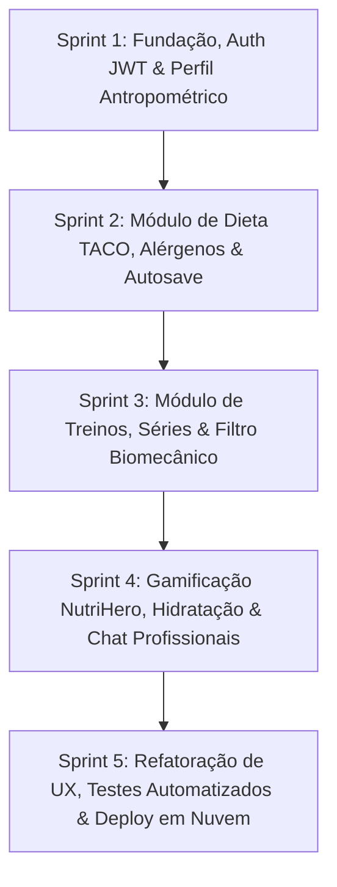

# Fase 1 — Processo e Planejamento
**Instituição:** FATEC Campinas  
**Curso:** Superior de Tecnologia em Análise e Desenvolvimento de Sistemas (ADS Noturno)  
**Disciplina:** LES — Laboratório de Engenharia de Software (2.2026)  
**Projeto:** NutriPlan — Sistema Integrado de Planejamento Nutricional, Periodização de Treino e Gamificação de Hábitos  
**Autor:** Gustavo Ruegenberg  
**Versão:** 2.0.0 — Outubro de 2026  

---

## 1. Definição do Problema

A adesão a hábitos consistentes de alimentação e treinamento físico representa um dos maiores desafios contemporâneos na área de saúde e bem-estar. Usuários que buscam iniciar ou otimizar seu condicionamento físico enfrentam obstáculos estruturais severos decorrentes da fragmentação das soluções digitais disponíveis:

1. **Fragmentação de Ferramentas e Descontinuidade de Dados:**
   Aplicativos líderes de mercado especializam-se em nichos isolados. Ferramentas como MyFitnessPal ou FatSecret focam quase que exclusivamente na contagem calórica, não oferecendo suporte a rotinas de musculação, controle de séries, repetições, carga (kg) ou avaliação biomecânica. Em contrapartida, aplicativos como Hevy ou Strong gerenciam o treinamento resistido, mas ignoram a ingestão calórica e o balanço energético. O usuário é forçado a alternar entre múltiplos aplicativos, gerando atrito e perda de visão holística.
2. **Insegurança Nutricional e Ignorância de Restrições Clínicas:**
   Muitos softwares não realizam uma anamnese inicial robusta de alergias e intolerâncias alimentares (como alergia a leite, ovos, amendoim, frutos do mar, intolerância à lactose, glúten ou sensibilidade a FODMAPs). Isso resulta em recomendações dietéticas inadequadas ou perigosas para indivíduos com limitações de saúde.
3. **Limitações Físicas e Risco de Lesões:**
   A maioria dos geradores de treino ignora o histórico de lesões articulares (ombros, joelhos, coluna lombar) ou musculares do atleta, recomendando exercícios contraindicados que aumentam o risco de lesões agudas ou crônicas.
4. **Falta de Engajamento e Desistência Precoce:**
   A taxa de abandono de dietas e treinos atinge picos nos primeiros 30 dias. A ausência de mecanismos lúdicos de recompensa diária (gamificação positiva, acompanhamento de hidratação e metas progressivas) desmotiva o usuário iniciante.

---

## 2. Justificativa do Sistema

O desenvolvimento do **NutriPlan** justifica-se pelos seguintes fatores estratégicos e técnicos:

- **Centralização em Plataforma Única:** Unifica em um ecossistema coeso o controle antropométrico, anamnese clínica, prescrição dietética fundamentada e periodização de treinamento físico.
- **Rigor e Confiabilidade Nutricional:** Integra dados oficiais da **Tabela Brasileira de Composição de Alimentos (TACO - UNICAMP)** como fonte canônica de dados de alimentos nacionais, garantindo valores fidedignos de calorias, macronutrientes (proteínas, carboidratos, lipídios) e fibras dietéticas (DRI - 14g/1.000 kcal).
- **Segurança Alimentar e Biomecânica Proativa:** Implementa validação cruzada de alergias alimentares (filtrando e sinalizando ingredientes alérgenos antes de compor a refeição) e checagem de lesões mapeadas para contraindicar movimentos perigosos.
- **Gamificação do Hábito Saudável:** Transforma a rotina diária de hidratação, alimentação e treino em progresso no módulo NutriHero RPG e no Mascote Virtual, incentivando a retenção a longo prazo.
- **Conexão com Especialistas:** Módulo integrado para compartilhamento de prontuário / anamnese em um clique com nutricionistas e personais cadastrados, viabilizando acompanhamento profissional.
- **Excelência em Engenharia de Software:** Aplicação formal dos conceitos de ciclo de vida, Clean Architecture em 4 camadas, Domain-Driven Design (DDD), automação de testes com Vitest e orquestração de deploy contínuo em nuvem.

---

## 3. Identificação e Análise dos Stakeholders

| Stakeholder | Categoria | Interesses e Expectativas | Grau de Influência / Impacto |
| :--- | :--- | :--- | :--- |
| **Praticante de Atividade Física (Usuário)** | Primário (Externo) | Planejar dietas personalizadas, controlar macros, periodizar treinos, acompanhar água e manter motivação. | Alto / Alto |
| **Nutricionista / Personal Trainer** | Primário (Parceiro) | Receber prontuários de anamnese consolidados e acompanhar a evolução dos alunos/pacientes via chat. | Médio / Alto |
| **Professor / Banca Examinadora FATEC** | Regulador (Acadêmico) | Avaliar a conformidade do processo de software, Clean Architecture, qualidade do código, testes e rastreabilidade. | Alto / Alto |
| **Engenheiro de Software (Desenvolvedor)** | Executor | Implementar o sistema com altos padrões de arquitetura, sem débito técnico e dentro do prazo letivo. | Alto / Alto |

---

## 4. Modelo de Processo Adotado

### Modelo: **Processo Incremental com Práticas Ágeis (Scrum Adaptado)**

**Justificativa Técnica:**
- **Inadequação do Modelo Cascata:** O modelo sequencial clássico (Cascata) impede a validação rápida de hipóteses de interface, reatividade em dispositivos móveis e testes contínuos de regras clínicas.
- **Adoção do Scrum Adaptado:** Como se trata de um desenvolvimento individual em contexto acadêmico, as reuniões de time foram convertidas em rotinas de inspeção contínua e sprints incrementais quinzenais (2 semanas cada), com entregas verticais funcionais e testáveis a cada iteração.

---

## 5. Definição do Ciclo de Vida do Projeto

O ciclo de vida foi estruturado nas **5 Fases Formais da Engenharia de Software**, atendendo integralmente à proposta pedagógica da FATEC Campinas:

1. **Fase 1 — Processo e Planejamento (Engenharia de Software I):**  
   Definição do problema, justificativa, stakeholders, modelo de processo, escopo, cronograma, riscos e critérios de qualidade (ISO/IEC 25010).
2. **Fase 2 — Engenharia de Requisitos (Engenharia de Software II):**  
   Técnicas de elicitação, especificação formal de requisitos funcionais (RF), não-funcionais (RNF) e regras de negócio (RN), modelagem de processos BPMN, casos de uso UML, matriz de rastreabilidade e controle de mudanças.
3. **Fase 3 — Análise, Arquitetura e Projeto (Engenharia de Software III):**  
   Clean Architecture em 4 camadas desacopladas (Domain, Application, Infrastructure, Presentation), justificativa de padrões de projeto (GoF e DDD), diagramas de classes, diagramas comportamentais (atividade e sequência), modelagem NoSQL do banco Firestore e planejamento de testes.
4. **Fase 4 — Implementação e Testes:**  
   Desenvolvimento em TypeScript com NestJS e React/Vite, repositório versionado Git, execução de testes automatizados unitários/integração via Vitest (52 testes com 100% de sucesso) e relatório de rastreamento de defeitos corrigidos.
5. **Fase 5 — Implantação e Encerramento:**  
   Plano de implantação em nuvem contínua (Render Cloud com Blueprint `render.yaml`), manuais do usuário e técnico, análise crítica do processo adotado, melhorias e lições aprendidas.

---

## 6. Plano de Projeto

### 6.1 Escopo do Produto

- **Módulo de Autenticação e Anamnese Clínica:**
  - Cadastro, login seguro, login social Google OAuth 2.0 e verificação transacional por e-mail (Resend API).
  - Cálculo de Taxa Metabólica Basal (TMB - Mifflin-St Jeor) e Gasto Calórico Total (TDEE).
  - Mapeamento detalhado de alergias alimentares, intolerâncias conhecidas e necessidade de acompanhamento médico.
  - Avaliação de lesões musculares, dores articulares e movimentos limitados.
- **Módulo de Planejamento Nutricional (Dieta):**
  - Catálogo TACO (UNICAMP) com busca instantânea.
  - Montagem de refeições com cálculo automático de calorias, macronutrientes e fibras.
  - Detecção e aviso preventivo de alérgenos na mesma página (modal interativo sem redirecionamento).
  - Cálculo de déficit calórico sustentável e exportação/importação em JSON.
- **Módulo de Periodização de Treinamento (Treino):**
  - Catálogo de exercícios por agrupamento muscular e equipamento disponível.
  - Montagem de rotinas divididas por dias, séries (Warm-up, Normal, Drop-Set, Rest-Pause, Top-Set), repetições, carga (kg), tempo de descanso e esforço percebido (RPE).
  - Cálculo de volume de treino e alerta de segurança para lesões prévias.
- **Módulo de Gamificação de Hábitos & Hidratação:**
  - Controle diário de copos d'água com meta calculada e lembretes visuais.
  - Mascote virtual NutriPet com evolução atrelada ao cumprimento dos hábitos.
  - NutriHero RPG com batalha em tempo real, equipamentos e recompensas diárias.
- **Módulo de Conexão com Profissionais de Saúde:**
  - Diretório de nutricionistas e preparadores físicos certificados.
  - Compartilhamento instantâneo da anamnese e rotina em um clique.
  - Chat em tempo real para alinhamento profissional.

### 6.2 Cronograma Físico-Financeiro (10 Semanas)

| Período | Semana | Entregável / Foco Principal | Status |
| :--- | :--- | :--- | :--- |
| **Fase 1 & 2** | Semanas 1–2 | Planejamento, Elicitação de Requisitos, Casos de Uso, Matriz de Rastreabilidade | Concluído |
| **Fase 3** | Semana 3 | Definição da Clean Architecture, Diagramas UML (Classes, Sequência, Atividades) | Concluído |
| **Fase 4 (Sprint 1)** | Semanas 4–5 | Backend NestJS, Autenticação JWT, Argon2, Anamnese e Google OAuth | Concluído |
| **Fase 4 (Sprint 2)** | Semanas 6–7 | Módulo de Dieta TACO, Motor de Cálculo de Macros, Validação de Alérgenos | Concluído |
| **Fase 4 (Sprint 3)** | Semanas 8–9 | Módulo de Treinos, Gamificação NutriHero, Hidratação e Chat com Profissionais | Concluído |
| **Fase 5** | Semana 10 | Refatoração de UX, Testes Automatizados (Vitest), Deploy Render e Manuais | Concluído |

### 6.3 Gestão e Matriz de Riscos

| ID | Risco Identificado | Probabilidade | Impacto | Estratégia de Mitigação |
| :--- | :--- | :--- | :--- | :--- |
| **R01** | **Perda de dados por hibernação em servidores de nuvem gratuitos (Render Free Tier)** | Alta | Crítico | Implementação de persistência NoSQL com suporte à variável `FIREBASE_SERVICE_ACCOUNT`, cache inteligente em disco e persistência de dados do usuário no cliente local sem wipes indevidos. |
| **R02** | **Expiração precoce de sessão JWT causando perda de formulários não salvos** | Alta | Alto | Extensão do tempo de vida do JWT para 30 dias (`30d`), mitigando quedas prematuras de sessão e preservando dados em `localStorage`. |
| **R03** | **Dependência de APIs externas de alimentos com indisponibilidade** | Média | Alto | Pré-carregamento local e imutável de catálogo baseado na Tabela TACO oficial (UNICAMP). |
| **R04** | **Acoplamento excessivo entre camadas de negócio e banco de dados** | Média | Alto | Adoção estrita de Clean Architecture com Inversão de Dependências (Ports & Adapters), mantendo as regras de negócio 100% isoladas de bibliotecas externas. |
| **R05** | **Regressão de regras matemáticas de cálculo de TMB e macronutrientes** | Média | Alto | Implementação de suíte de 52 testes automatizados no Vitest executados em pipeline antes de cada deploy. |

---

## 7. Definição de Critérios de Qualidade (Norma ISO/IEC 25010)

- **Adequação Funcional:** Implementação e conformidade de 100% dos requisitos prioritários definidos no SRS.
- **Confiabilidade e Tolerância a Falhas:** Suporte a reconexão automática de sessão JWT após reinício de instâncias e tolerância a instabilidade de rede via cache local seguro.
- **Segurança da Informação:**
  - Criptografia irreversível de senhas com o algoritmo **Argon2id** com salt individual.
  - Autenticação com tokens assinados digitalmente por chave secreta via **JWT (Json Web Token)**.
  - Validação estrita de entrada em 100% dos endpoints com DTOs tipados e `ValidationPipe`.
- **Manutenibilidade:** Código desacoplado com padrão Clean Architecture; camada de domínio com zero dependências de bibliotecas externas.
- **Usabilidade:** Interface responsiva projetada segundo princípios de *Design System* moderno, paleta escura (Dark Theme), feedback háptico e tempos de carregamento instantâneos com Vite.
