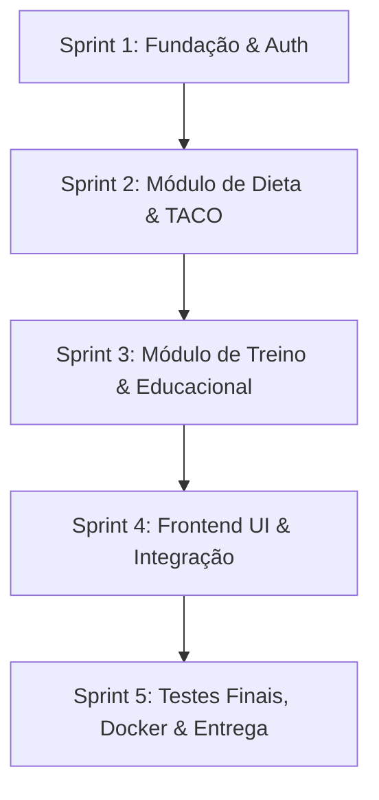

# Fase 1 — Processo e Planejamento
**Disciplina:** Engenharia de Software I  
**Projeto:** NutriPlan — Sistema de Planejamento de Dieta, Treino e Educação Científica  
**Autor:** Desenvolvedor Solo (Engenharia de Software)  
**Versão:** 1.0.0 — 2026-09-01  

---

## 1. Definição do Problema

A adesão a hábitos saudáveis de alimentação e treinamento físico é um desafio contemporâneo amplamente documentado pela literatura de saúde pública e ciência do esporte. Indivíduos que decidem iniciar ou otimizar seu condicionamento físico deparam-se com três barreiras primordiais:

1. **Fragmentação de Ferramentas:** Aplicativos de controle calórico (e.g., MyFitnessPal) não oferecem módulos estruturados para montagem de rotinas de musculação e periodização. Simultaneamente, aplicativos focados em treinos (e.g., Hevy, Strong) não realizam controle nutricional ou cálculo de macronutrientes.
2. **Incerteza e Desinformação Nutricional:** A internet abriga abundante conteúdo pseudocientífico sobre dietas e treinos. O usuário leigo não possui acesso facilitado a resumos didáticos de artigos revisados por pares (peer-reviewed) para fundamentar suas escolhas.
3. **Falta de Portabilidade e Autonomia:** Plataformas proprietárias impõem barreiras de aprisionamento (*vendor lock-in*), impedindo a exportação ou importação aberta de suas próprias rotinas e planos alimentares em formatos estruturados como JSON.

---

## 2. Justificativa do Sistema

O desenvolvimento do **NutriPlan** justifica-se por:
- **Centralização Integrada:** Permite o gerenciamento unificado de dieta e treino em um único ecossistema coerente.
- **Confiabilidade Científica:** Integra a **Tabela Brasileira de Composição de Alimentos (TACO - UNICAMP)** como fonte canônica de dados de alimentos nacionais e disponibiliza um repositório didático de artigos científicos com identificadores DOI / PubMed.
- **Autonomia do Usuário:** Mecanismos de exportação e importação em formato padronizado JSON, assegurando interoperabilidade.
- **Rigor em Engenharia de Software:** Aplicação prática dos conceitos de ciclo de vida, Clean Architecture, testes automatizados e gestão ágil de riscos.

---

## 3. Identificação e Análise dos Stakeholders

| Stakeholder | Categoria | Interesses e Expectativas | Grau de Influência / Impacto |
| :--- | :--- | :--- | :--- |
| **Usuário Praticante de Atividade Física** | Primário (Externo) | Montar dietas personalizadas, controlar macros, montar treinos e exportar relatórios. | Alto / Alto |
| **Administrador / Pesquisador** | Secundário (Interno) | Gerenciar catálogo de alimentos, cadastrar resumos de artigos científicos indexados. | Médio / Médio |
| **Professor / Banca Avaliadora** | Regulador (Acadêmico) | Avaliar conformidade do software com as 3 disciplinas de Engenharia de Software, arquitetura limpa, testes e rastreabilidade. | Alto / Alto |
| **Engenheiro de Software (Desenvolvedor)** | Executor | Desenvolver com padrões de excelência técnica dentro do prazo estipulado (10 semanas). | Alto / Alto |

---

## 4. Modelo de Processo Adotado

### Modelo: **Processo Incremental com Práticas Ágeis (Scrum Adaptado)**

**Justificativa Técnica:**
- **Inadequação do Modelo Cascata:** Em projetos com prazos de 2 a 3 meses, o modelo em cascata impõe alto risco de entrega tardia e impossibilita validações antecipadas de arquitetura e usabilidade.
- **Adoção do Scrum Adaptado:** Por se tratar de um desenvolvimento individual, cerimônias de equipe (Daily Scrum, Planning Poker) foram convertidas em rotinas de auto-gestão técnica com sprints quinzenais (2 semanas) e entregas incrementais funcionais.

---

## 5. Definição do Ciclo de Vida do Projeto

O ciclo de vida foi estruturado em **5 Fases Formais**:

1. **Fase 1 — Processo e Planejamento:** Escopo, cronograma, modelo de ciclo de vida, identificação de riscos e critérios de qualidade.
2. **Fase 2 — Engenharia de Requisitos:** Elicitação, especificação formal de RF/RNF/RN, modelagem de casos de uso e matriz de rastreabilidade.
3. **Fase 3 — Análise, Arquitetura e Projeto:** Clean Architecture em 4 camadas, diagramas UML (Classes, Sequência), modelo relacional e planejamento de testes.
4. **Fase 4 — Implementação e Testes:** Codificação em NestJS/TypeScript, testes unitários, testes de integração, relatórios de cobertura.
5. **Fase 5 — Implantação e Encerramento:** Dockerização, manuais do usuário e técnico, análise crítica e lições aprendidas.

---

## 6. Plano de Projeto

### 6.1 Escopo do Produto

- **Módulo de Autenticação e Perfil:** Registro seguro, autenticação JWT, cálculo de Taxa Metabólica Basal (TMB - Mifflin-St Jeor) e Gasto Calórico Diário (TDEE).
- **Módulo de Dieta:** Catálogo de alimentos TACO, pesquisa com busca textual, montagem de planos com refeições e cálculo automático de macronutrientes, importação/exportação JSON.
- **Módulo de Treino:** Catálogo de exercícios por agrupamento muscular, montagem de rotinas com séries/repetições/cargas/RPE, cálculo de volume total, importação/exportação JSON.
- **Módulo Educacional:** Repositório de resumos de artigos científicos com tags e links para bases oficiais.

### 6.2 Cronograma Físico (10 Semanas)

| Período | Semana | Entregável / Foco Principal |
| :--- | :--- | :--- |
| **Fase 1 & 2** | Semanas 1–2 | Planejamento, Requisitos, Casos de Uso, Matriz de Rastreabilidade |
| **Fase 3** | Semana 3 | Arquitetura de Software, Modelagem ERD, Diagramas de Classes e Sequência |
| **Fase 4 (Sprint 1)** | Semanas 4–5 | Scaffolding NestJS, Prisma ORM, Módulo de Autenticação + Testes |
| **Fase 4 (Sprint 2)** | Semanas 6–7 | Módulo de Dieta + Seed TACO + Cálculo de Macros + Testes |
| **Fase 4 (Sprint 3)** | Semanas 8–9 | Módulo de Treinos + Módulo Educacional + Import/Export + Testes |
| **Fase 5** | Semana 10 | Docker, Manuais, Análise Crítica e Fechamento do Projeto |

### 6.3 Gestão e Matriz de Riscos

| Risco | Probabilidade | Impacto | Estratégia de Mitigação |
| :--- | :--- | :--- | :--- |
| **R01 — Atraso por complexidade de domínio** | Média | Alto | Priorização via MoSCoW; isolamento de regras em Value Objects e Domain Services testáveis. |
| **R02 — Dependência de APIs externas de alimentos com instabilidade** | Alta | Alto | Pré-carregamento local do dataset oficial TACO (75+ itens balanceados) no banco Postgres. |
| **R03 — Acoplamento arquitetural prematuro** | Média | Alto | Adoção rigorosa de Clean Architecture com Ports & Adapters e Inversão de Dependências. |
| **R04 — Falhas em regressão de código** | Média | Médio | Suíte de testes unitários automatizados via Vitest com cobertura mínima estabelecida em 70%. |

---

## 7. Definição de Critérios de Qualidade (Norma ISO/IEC 25010)

- **Adequação Funcional:** Implementação e conformidade de 100% dos requisitos prioritários (Must Have).
- **Confiabilidade e Maturidade:** Cobertura de testes unitários superior a 70% nas camadas de Domínio e Casos de Uso.
- **Manutenibilidade:** Domínio livre de dependências de infraestrutura (Zero imports de Prisma/NestJS na camada Domain).
- **Segurança:** Criptografia de senhas com algoritmo Argon2 e autorização baseada em tokens JWT e Guards de perfil (RBAC).
- **Portabilidade:** Empacotamento integral via Docker e Docker Compose.
