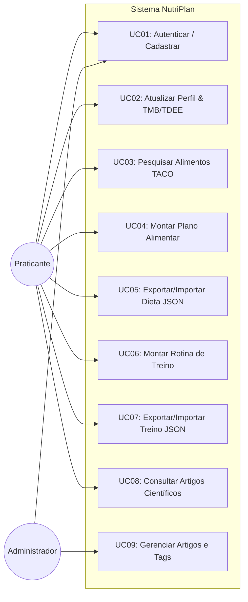

# Fase 2 — Engenharia de Requisitos
**Disciplina:** Engenharia de Software II  
**Projeto:** NutriPlan — Sistema de Planejamento de Dieta, Treino e Educação Científica  
**Versão:** 1.0.0 — 2026-09-01  

---

## 1. Técnicas de Elicitação Utilizadas

1. **Benchmarking Competitivo:** Análise funcional e heurística de plataformas consolidadas de nutrição e treino (MyFitnessPal, FatSecret, Hevy, Strong).
2. **Engenharia Reversa de Dados Nutricionais:** Análise da estrutura dimensional da Tabela Brasileira de Composição de Alimentos (TACO - 4ª Edição, UNICAMP).
3. **Prototipação Exploratória:** Validação de fluxos de montagem de refeições, listas de séries e visualização de resumos científicos.

---

## 2. Documento de Requisitos de Software (SRS)

### 2.1 Requisitos Funcionais (RF)

| ID | Descrição do Requisito Funcional | Prioridade (MoSCoW) | Módulo |
| :--- | :--- | :--- | :--- |
| **RF01** | Permitir o cadastro de novos usuários com e-mail único, senha e nome. | Must Have | Autenticação |
| **RF02** | Realizar login de usuários gerando tokens JWT com controle de expiração. | Must Have | Autenticação |
| **RF03** | Permitir a atualização do perfil antropométrico (peso, altura, idade, sexo, atividade, meta). | Must Have | Autenticação |
| **RF04** | Calcular automaticamente a TMB (Taxa Metabólica Basal) e TDEE (Gasto Energético Diário). | Should Have | Autenticação |
| **RF05** | Permitir a consulta e busca textual insensible de alimentos na base TACO. | Must Have | Dieta |
| **RF06** | Exibir os macronutrientes detalhados de cada alimento (calorias, proteínas, carboidratos, gorduras e fibras). | Must Have | Dieta |
| **RF07** | Permitir a criação de planos alimentares contendo dias da semana e múltiplas refeições. | Must Have | Dieta |
| **RF08** | Calcular e totalizar calorias e macronutrientes proporcionais por alimento, refeição e dia. | Must Have | Dieta |
| **RF09** | Permitir a exportação de planos alimentares em formato JSON estruturado. | Should Have | Dieta |
| **RF10** | Permitir a importação de planos alimentares a partir de arquivos JSON válidos. | Should Have | Dieta |
| **RF11** | Disponibilizar catálogo de exercícios de musculação agrupados por grupo muscular e equipamento. | Must Have | Treino |
| **RF12** | Permitir a criação de rotinas de treino organizadas por dias da semana e exercícios com séries. | Must Have | Treino |
| **RF13** | Permitir o registro detalhado de séries contendo repetições, carga (kg), tempo de descanso e RPE. | Must Have | Treino |
| **RF14** | Calcular automaticamente o volume total de carga e volume por agrupamento muscular. | Should Have | Treino |
| **RF15** | Permitir a exportação de rotinas de treino em formato JSON. | Should Have | Treino |
| **RF16** | Permitir a importação de rotinas de treino via JSON. | Should Have | Treino |
| **RF17** | Listar artigos científicos com título, resumo didático, tags temáticas e link original (DOI/PubMed). | Must Have | Educacional |
| **RF18** | Filtrar artigos científicos por tags temáticas (e.g., Nutrição, Proteína, Hipertrofia, Saúde). | Should Have | Educacional |
| **RF19** | Permitir o cadastro e gerenciamento de novos artigos e tags (acesso restrito ADMIN). | Should Have | Educacional |

---

### 2.2 Requisitos Não Funcionais (RNF)

| ID | Descrição do Requisito Não Funcional | Categoria |
| :--- | :--- | :--- |
| **RNF01** | As senhas devem ser obrigatoriamente cifradas com algoritmo criptográfico **Argon2id**. | Segurança |
| **RNF02** | As rotas protegidas da API devem validar tokens JWT no cabeçalho `Authorization: Bearer <token>`. | Segurança |
| **RNF03** | A busca de alimentos na base TACO deve responder em tempo inferior a 300ms. | Desempenho |
| **RNF04** | O sistema deve ser estruturado em **Clean Architecture** desacoplando o domínio de frameworks. | Arquitetura |
| **RNF05** | As entidades de domínio e casos de uso devem atingir cobertura de testes unitários ≥ 70%. | Confiabilidade |
| **RNF06** | A persistência relacional deve ser gerenciada pelo **PostgreSQL 16** via **Prisma ORM**. | Infraestrutura |
| **RNF07** | O sistema deve disponibilizar documentação viva dos endpoints em padrão **OpenAPI / Swagger**. | Documentação |
| **RNF08** | Todo o sistema deve ser executável em contêineres **Docker**. | Portabilidade |

---

### 2.3 Regras de Negócio (RN)

- **RN01 (Cálculo Calórico dos Macronutrientes):** Calorias = $(Proteínas \times 4) + (Carboidratos \times 4) + (Gorduras \times 9)$.
- **RN02 (Fórmula de TMB de Mifflin-St Jeor):**
  - Homens: $TMB = (10 \times peso\_kg) + (6.25 \times altura\_cm) - (5 \times idade) + 5$
  - Mulheres: $TMB = (10 \times peso\_kg) + (6.25 \times altura\_cm) - (5 \times idade) - 161$
- **RN03 (Proporcionalidade dos Alimentos):** A base TACO possui valores por 100g. Para uma quantidade $Q$ em gramas, o valor real é $\frac{Valor100g \times Q}{100}$.
- **RN04 (Unicidade de Plano Ativo):** O usuário pode manter múltiplos planos cadastrados, mas apenas um plano de dieta e uma rotina de treino podem estar marcados como `isActive = true` simultaneamente.
- **RN05 (Integridade de Importação):** A importação de planos e rotinas via JSON deve validar a existência dos IDs de alimentos/exercícios ou emitir falha controlada `404 Not Found`.

---

## 3. Diagrama de Casos de Uso (UML)

---

## 4. Matriz de Rastreabilidade de Requisitos

| Requisito | Caso de Uso | Entidade de Domínio | Caso de Teste Unitário | Endpoint da API |
| :--- | :--- | :--- | :--- | :--- |
| **RF01, RF02** | UC01 | `UserEntity` | `user.entity.spec.ts`, `register.use-case.spec.ts`, `login.use-case.spec.ts` | `POST /auth/register`, `POST /auth/login` |
| **RF03, RF04** | UC02 | `UserEntity` | `user.entity.spec.ts` | `GET /auth/profile`, `PATCH /auth/profile` |
| **RF05, RF06** | UC03 | `FoodItem`, `MacroNutrients` | `macro-nutrients.spec.ts` | `GET /foods/search`, `GET /foods/:id` |
| **RF07, RF08** | UC04 | `DietPlan`, `MacroCalculatorService` | `create-diet-plan.use-case.spec.ts`, `macro-calculator.service.spec.ts` | `POST /diet-plans`, `GET /diet-plans/:id` |
| **RF09, RF10** | UC05 | `DietPlan` | `create-diet-plan.use-case.spec.ts` | `GET /diet-plans/:id/export`, `POST /diet-plans/import` |
| **RF11, RF12, RF13, RF14** | UC06 | `Routine`, `WorkoutDay`, `WorkoutSet` | `routine.entity.spec.ts` | `POST /routines`, `GET /routines/:id` |
| **RF15, RF16** | UC07 | `Routine` | `routine.entity.spec.ts` | `GET /routines/:id/export`, `POST /routines/import` |
| **RF17, RF18, RF19** | UC08, UC09 | `Article` | `list-articles.use-case.spec.ts` | `GET /articles`, `POST /articles` |

---

## 5. Processo de Controle de Mudanças

As alterações de requisitos seguem o fluxo formal:
1. Registro de *Change Request* (CR) via Issue no GitHub com justificativa de negócio.
2. Avaliação de impacto arquitetural e estimativa de esforço.
3. Atualização da Matriz de Rastreabilidade e especificação de novos casos de teste.
4. Implementação e merge via Pull Request com verificação em pipeline automatizado.
