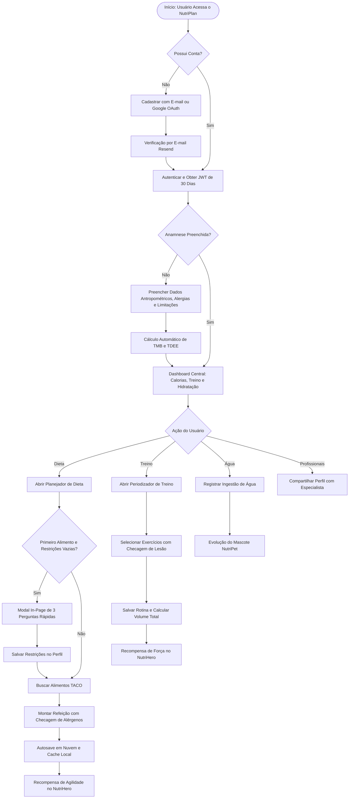
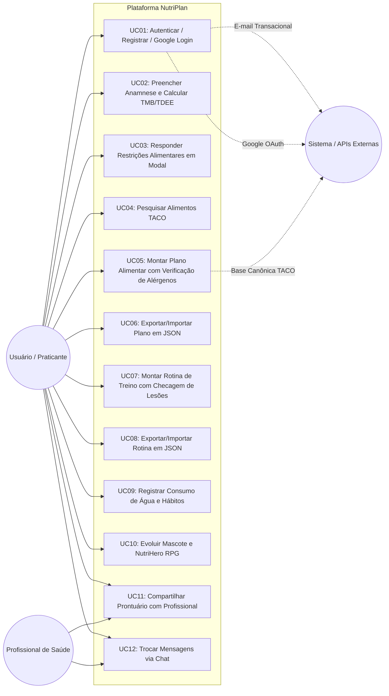

# Fase 2 — Engenharia de Requisitos
**Instituição:** FATEC Campinas  
**Curso:** Superior de Tecnologia em Análise e Desenvolvimento de Sistemas (ADS Noturno)  
**Disciplina:** LES — Laboratório de Engenharia de Software (2.2026)  
**Projeto:** NutriPlan — Sistema Integrado de Planejamento Nutricional, Periodização de Treino e Gamificação de Hábitos  
**Autor:** Gustavo Ruegenberg  
**Versão:** 2.0.0 — Outubro de 2026  

---

## 1. Técnicas de Elicitação Utilizadas

Para a concepção e detalhamento dos requisitos do NutriPlan, foram combinadas três técnicas formais de Engenharia de Requisitos:

1. **Benchmarking Competitivo de Heurísticas:**  
   Análise comparativa das principais plataformas de mercado (*MyFitnessPal*, *FatSecret*, *Hevy*, *Strong*, *Nike Training Club*), identificando lacunas críticas: ausência de integração direta entre treino e dieta, interfaces poluídas e falta de checagem automatizada de alérgenos e lesões articulares.
2. **Engenharia Reversa de Bases Normativas e Clínicas:**  
   Estudo da estrutura de dados da **Tabela Brasileira de Composição de Alimentos (TACO - UNICAMP)**, das diretrizes de Ingestão Diária Recomendada de Fibras (*Dietary Reference Intakes - DRI / National Academies*, 14g a cada 1.000 kcal) e das equações metabólicas validadas de **Mifflin-St Jeor**.
3. **Prototipagem Interativa e Feedback Contínuo de Usuário:**  
   Desenvolvimento de protótipos funcionais com validação direta de fluxos de montagem de refeições, simplificação radical da navegação para 4 abas centrais e eliminação de fricções na anamnese inicial (modal em página única).

---

## 2. Documento de Requisitos de Software (SRS)

### 2.1 Requisitos Funcionais (RF)

| ID | Descrição do Requisito Funcional | Prioridade (MoSCoW) | Módulo |
| :--- | :--- | :--- | :--- |
| **RF01** | Permitir o cadastro de novos usuários com e-mail, senha criptografada e nome completo. | Must Have | Autenticação |
| **RF02** | Permitir a autenticação de usuários via credenciais locais (e-mail/senha) e emitir token JWT. | Must Have | Autenticação |
| **RF03** | Oferecer login social de um clique através de credenciais autorizadas do **Google OAuth 2.0**. | Should Have | Autenticação |
| **RF04** | Validar a posse de conta de novos usuários através do envio de código de verificação por e-mail (Resend API). | Should Have | Autenticação |
| **RF05** | Permitir o preenchimento de perfil antropométrico: peso (kg), altura (cm), idade, sexo biológico, meta e atividade. | Must Have | Perfil / Anamnese |
| **RF06** | Calcular automaticamente a Taxa Metabólica Basal (TMB - Mifflin-St Jeor) e o Gasto Calórico Total Diário (TDEE). | Must Have | Perfil / Anamnese |
| **RF07** | Registrar e gerenciar a anamnese de restrições alimentares: alergias (com seleção e adição personalizada), intolerâncias e necessidade de supervisão profissional. | Must Have | Perfil / Anamnese |
| **RF08** | Registrar e gerenciar as condições para exercícios: nível de experiência com treinos, frequência pretendida, lesões musculares, dores articulares e equipamentos disponíveis. | Must Have | Perfil / Anamnese |
| **RF09** | Apresentar um modal interativo na mesma página para preenchimento de restrições alimentares no primeiro alimento adicionado, sem redirecionamento externo. | Must Have | Dieta |
| **RF10** | Permitir a pesquisa instantânea de alimentos na base oficial TACO com filtros e informações nutricionais por 100g. | Must Have | Dieta |
| **RF11** | Permitir a montagem e organização de planos alimentares por dias da semana e refeições personalizadas. | Must Have | Dieta |
| **RF12** | Calcular e recalcular em tempo real o balanço calórico e os macronutrientes proporcionais (proteínas, carboidratos, gorduras e fibras). | Must Have | Dieta |
| **RF13** | Sinalizar de forma preventiva alimentos que contenham alérgenos ou intolerâncias configuradas pelo usuário. | Must Have | Dieta |
| **RF14** | Permitir salvar e reutilizar refeições favoritas com um clique. | Should Have | Dieta |
| **RF15** | Permitir a exportação e importação de planos alimentares completos em formato JSON estruturado. | Should Have | Dieta |
| **RF16** | Disponibilizar catálogo de exercícios de musculação agrupados por grupo muscular e equipamento. | Must Have | Treino |
| **RF17** | Permitir a criação e edição de rotinas de treino por dias da semana contendo exercícios e séries prescritas. | Must Have | Treino |
| **RF18** | Registrar detalhes de execução de cada série: repetições, carga (kg), tempo de descanso, tipo (Normal, Drop-set, Warm-up, Rest-pause, Top-set) e RPE. | Must Have | Treino |
| **RF19** | Calcular o volume total de carga e o volume por agrupamento muscular da rotina. | Should Have | Treino |
| **RF20** | Alerta biomecânico preventivo contra exercícios que tensionem articulações ou músculos com dor ou lesão cadastrada. | Should Have | Treino |
| **RF21** | Permitir a exportação e importação de rotinas de treino em formato JSON. | Should Have | Treino |
| **RF22** | Acompanhar a hidratação diária do usuário, calculando meta em ml e permitindo o registro instantâneo de ingestão de água. | Must Have | Hábitos / Água |
| **RF23** | Gerenciar o Mascote Virtual (NutriPet) e o sistema de RPG (NutriHero), recompensando check-in de treino e cumprimento de dieta. | Could Have | Gamificação |
| **RF24** | Disponibilizar listagem de profissionais de saúde (nutricionistas e personais) com chat em tempo real e compartilhamento de prontuário em 1 clique. | Should Have | Profissionais |

---

### 2.2 Requisitos Não Funcionais (RNF)

| ID | Descrição do Requisito Não Funcional | Categoria |
| :--- | :--- | :--- |
| **RNF01** | Criptografia irreversível de senhas com algoritmo **Argon2id** com salt individualizado. | Segurança |
| **RNF02** | Sessões de autenticação persistentes com tokens **JWT** com tempo de vida de 30 dias (`30d`). | Usabilidade / Segurança |
| **RNF03** | Interface web responsiva construída em **Single Page Application (SPA)** com React 19, Vite e Tailwind CSS. | Portabilidade / Desempenho |
| **RNF04** | Adoção estrita do padrão arquitetural **Clean Architecture** com desacoplamento total entre Domínio e Infraestrutura. | Arquitetura |
| **RNF05** | Cobertura de testes unitários automatizados com **Vitest** superior a 70% nas camadas de Domínio e Casos de Uso. | Confiabilidade |
| **RNF06** | Tempo de resposta para consultas de catálogo de alimentos inferior a 250ms sob carga normal. | Desempenho |
| **RNF07** | Persistência resiliente NoSQL em nuvem via **Firebase Cloud Firestore** com camada de cache local de alta disponibilidade. | Confiabilidade |
| **RNF08** | Documentação viva de contratos de API REST padronizada conforme especificação **OpenAPI / Swagger 3.0**. | Manutenibilidade |

---

### 2.3 Regras de Negócio (RN)

- **RN01 — Cálculo Calórico Padrão Atwater:**  
  $$\text{Calorias (kcal)} = (\text{Proteínas} \times 4) + (\text{Carboidratos} \times 4) + (\text{Gorduras} \times 9)$$
- **RN02 — Equação Metabólica Basal de Mifflin-St Jeor:**  
  $$\text{TMB (Homens)} = (10 \times \text{peso}_{\text{kg}}) + (6.25 \times \text{altura}_{\text{cm}}) - (5 \times \text{idade}) + 5$$  
  $$\text{TMB (Mulheres)} = (10 \times \text{peso}_{\text{kg}}) + (6.25 \times \text{altura}_{\text{cm}}) - (5 \times \text{idade}) - 161$$
- **RN03 — Gasto Energético Total Diário (TDEE):**  
  $\text{TDEE} = \text{TMB} \times \text{Fator de Atividade}$ (Sedentário: 1.2, Leve: 1.375, Moderado: 1.55, Muito Ativo: 1.725, Extremamente Ativo: 1.9).
- **RN04 — Meta Científica de Fibras Alimentares:**  
  Conforme diretrizes das DRIs da National Academies: $14\text{g de fibras a cada } 1.000\text{ kcal}$ consumidas.
- **RN05 — Proporcionalidade Canônica dos Alimentos TACO:**  
  Os dados na base TACO referem-se à porção canônica de $100\text{g}$. Para uma quantidade $Q$ em gramas, cada nutriente é calculado como $\frac{\text{Nutriente}_{100\text{g}} \times Q}{100}$.
- **RN06 — Unicidade de Plano Ativo:**  
  O usuário pode armazenar múltiplos planos e rotinas no histórico, mas somente um plano de dieta e uma rotina de treino podem possuir o estado `isActive = true` simultaneamente.
- **RN07 — Proteção Ativa de Alergias e Intolerâncias:**  
  Caso o usuário possua alergia alimentar cadastrada (e.g. *Leite*, *Amendoim*, *Frutos do mar*), qualquer alimento contendo o termo correspondente deve exibir uma tag de aviso visual vermelho imediata na interface, alertando o risco antes da confirmação.
- **RN08 — Preservação de Dados de Sessão:**  
  Falhas temporárias de conexão ou expiração de token não devem apagar os planos locais (`localStorage`) de dieta e treino criados pelo usuário. Apenas as chaves de credencial (`nutriplan_token` e `nutriplan_user`) são removidas no logout.

---

## 3. Modelagem de Negócio (Processo de Negócio - BPMN)

O fluxo principal do usuário dentro da plataforma é sumarizado no fluxograma de atividades de negócio abaixo:

---

## 4. Diagrama de Casos de Uso (UML)

---

## 5. Matriz de Rastreabilidade de Requisitos

A matriz abaixo estabelece a rastreabilidade bidirecional exigida pela Engenharia de Software, conectando Requisitos Funcionais, Casos de Uso, Entidades de Domínio, Testes Automatizados no Vitest e Endpoints da API:

| Requisito Funcional | Caso de Uso | Entidade de Domínio | Caso de Teste Unitário (Vitest) | Endpoint da API |
| :--- | :--- | :--- | :--- | :--- |
| **RF01, RF02, RF03, RF04** | UC01 | `UserEntity` | `user.entity.spec.ts`, `register.use-case.spec.ts`, `login.use-case.spec.ts` | `POST /auth/register`, `POST /auth/login`, `POST /auth/google`, `POST /auth/verify-email` |
| **RF05, RF06, RF07, RF08** | UC02, UC03 | `UserEntity`, `MacroCalculatorService` | `user.entity.spec.ts`, `macro-calculator.service.spec.ts` | `GET /auth/profile`, `PATCH /auth/profile` |
| **RF09, RF10** | UC03, UC04 | `FoodItem`, `MacroNutrients` | `macro-nutrients.spec.ts` | `GET /foods/search`, `GET /foods/:id` |
| **RF11, RF12, RF13, RF14** | UC05 | `DietPlan`, `DayPlan`, `Meal`, `MealItem`, `MacroNutrients` | `create-diet-plan.use-case.spec.ts`, `macro-calculator.service.spec.ts` | `POST /diet-plans`, `GET /diet-plans`, `GET /diet-plans/:id` |
| **RF15** | UC06 | `DietPlan` | `create-diet-plan.use-case.spec.ts` | `GET /diet-plans/:id/export`, `POST /diet-plans/import` |
| **RF16, RF17, RF18, RF19, RF20** | UC07 | `Routine`, `WorkoutDay`, `Exercise`, `WorkoutSet` | `routine.entity.spec.ts` | `POST /routines`, `GET /routines`, `GET /routines/:id` |
| **RF21** | UC08 | `Routine` | `routine.entity.spec.ts` | `GET /routines/:id/export`, `POST /routines/import` |
| **RF22, RF23** | UC09, UC10 | `Hero`, `Pet` | `loot-fusion.spec.ts`, `idle-combat.service.spec.ts`, `gamification.service.spec.ts` | `GET /gamification/pet`, `POST /gamification/pet/action`, `GET /idle-game/hero` |
| **RF24** | UC11, UC12 | `Professional`, `Conversation` | `professionals.spec.ts` | `GET /professionals`, `POST /professionals/share`, `GET /professionals/chat` |

---

## 6. Processo e Histórico Formal de Controle de Mudanças

As alterações de escopo e design ocorridas ao longo do ciclo de vida foram formalizadas através do seguinte fluxo:
1. Identificação do problema ou solicitação de mudança (*Change Request* - CR).
2. Análise de impacto na arquitetura, no banco de dados e nos casos de teste.
3. Execução das modificações, com atualização da documentação e execução dos testes no Vitest.
4. Registro de commit com mensagem semântica no Git e deploy contínuo.

### Histórico de Mudanças Realizadas (Change Log Formal):

| ID CR | Data | Descrição da Mudança Solicitada | Rationale Técnico e Impacto |
| :--- | :--- | :--- | :--- |
| **CR-01** | Out/2026 | **Remoção Integral do Módulo de Artigos Científicos** | A pedido do usuário, simplificou-se o produto eliminando a seção teórica de artigos para manter o foco exclusivo nos 3 pilares práticos: Dieta, Treino e Hábitos. As tabelas, rotas `/articles` e regras de gamificação associadas foram descontinuadas. |
| **CR-02** | Out/2026 | **Simplificação Radical de UX (4 Abas)** | Redução da barra de navegação inferior e desktop para 4 pilares: *Hoje (Dashboard)*, *Dieta*, *Treino* e *Perfil*. As seções secundárias foram integradas de forma contextual. |
| **CR-03** | Out/2026 | **Eliminação de Redundâncias na Anamnese de Treino** | Os campos duplicados de "Tempo de Prática em Meses" e "Experiência Prévia com Musculação" foram unificados em uma única lista coesa de "Nível de Experiência com Treinos", reduzindo a carga cognitiva do usuário. |
| **CR-04** | Out/2026 | **Modal de Restrições Alimentares In-Page** | Ao tentar adicionar o primeiro alimento na dieta, o usuário não é mais redirecionado para a página de perfil. Abre-se um modal direto na página com as 3 perguntas rápidas e atalho de 1 clique, continuando a ação automaticamente após o salvamento. |
| **CR-05** | Out/2026 | **Extensão da Sessão JWT para 30 Dias e Proteção contra Perda de Dados** | Identificada falha crítica de expiração de token em 15 minutos que disparava `logout()` destruindo dados do `localStorage`. A sessão foi estendida para 30 dias (`30d`), o `logout()` foi isolado para proteger dados locais e a estratégia JWT foi tornada tolerante a reinícios de instâncias em nuvem (Render sleep). |
