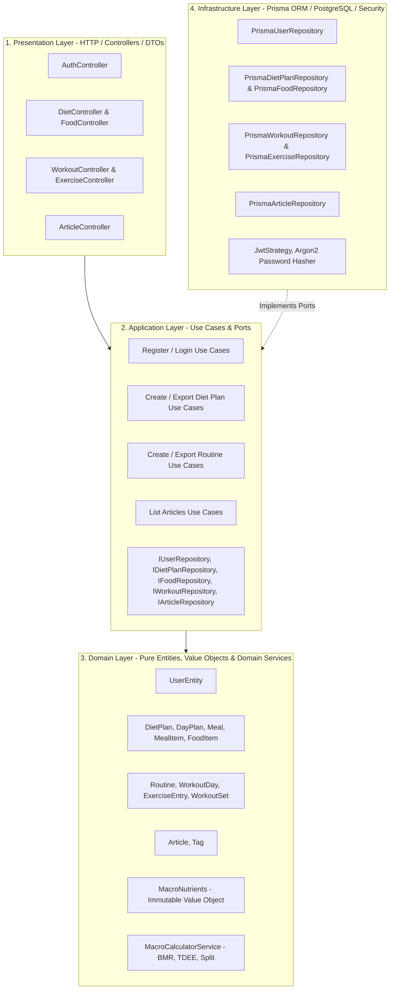
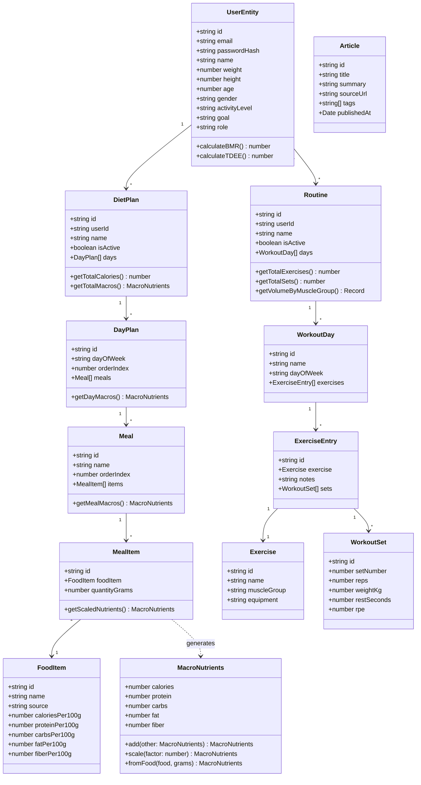

# Fase 3 — Análise, Arquitetura e Projeto
**Disciplina:** Engenharia de Software III  
**Projeto:** NutriPlan — Sistema de Planejamento de Dieta, Treino e Educação Científica  
**Versão:** 1.0.0 — 2026-09-01  

---

## 1. Definição Formal da Arquitetura

O sistema NutriPlan adota o padrão **Clean Architecture (Arquitetura Limpa / Onion Architecture)** estruturado como um **Monólito Modular**. Essa escolha garante independência de frameworks e orquestração desacoplada por casos de uso.



---

## 2. Justificativa dos Padrões de Projeto (Design Patterns)

| Padrão | Categoria | Onde foi aplicado no NutriPlan | Justificativa Técnica |
| :--- | :--- | :--- | :--- |
| **Repository** | Estrutural | `IUserRepository`, `IDietPlanRepository`, etc. | Isola a lógica de negócio das particularidades do Prisma ORM e PostgreSQL, permitindo mocks fáceis em testes unitários. |
| **Value Object** | Tático (DDD) | `MacroNutrients` | Garante imutabilidade e encapsula operações matemáticas de soma e escala proporcional de macronutrientes. |
| **Domain Service** | Tático (DDD) | `MacroCalculatorService` | Agrupa regras de cálculo que não pertencem exclusivamente a uma única entidade (fórmulas antropométricas TMB/TDEE e distribuição de macros). |
| **Data Transfer Object (DTO)** | Comportamental | `CreateDietPlanDto`, `RegisterDto`, etc. | Padroniza e valida contratos de entrada/saída HTTP com `class-validator` e gera documentação Swagger automaticamente. |
| **Dependency Injection** | Criacional | IoC Container do NestJS via Tokens (`'USER_REPOSITORY'`, etc.) | Inverte o controle de dependências, permitindo que a camada Application dependa de abstrações e não de implementações. |
| **Strategy / Guard** | Estrutural | `JwtAuthGuard`, `RolesGuard`, `JwtStrategy` | Intercepta requisições HTTP para validar assinaturas de tokens JWT e permissões de acesso por role (USER/ADMIN). |

---

## 3. Diagrama de Classes do Domínio (UML)



---

## 4. Diagrama de Sequência — Montagem e Cálculo de Dieta

```mermaid
sequenceDiagram
    autonumber
    actor User as Usuário
    participant Controller as DietController
    participant UseCase as CreateDietPlanUseCase
    participant FoodRepo as IFoodRepository
    participant DietRepo as IDietPlanRepository
    participant DB as PostgreSQL (Prisma)

    User->>Controller: POST /diet-plans (CreateDietPlanDto + Bearer JWT)
    Controller->>UseCase: execute(userId, dto)
    UseCase->>FoodRepo: findByIds(foodItemIds)
    FoodRepo->>DB: SELECT * FROM food_items WHERE id IN (...)
    DB-->>FoodRepo: FoodItem[]
    FoodRepo-->>UseCase: Alimentos encontrados
    alt Alimento não existe
        UseCase-->>Controller: throw NotFoundException("Food item not found")
        Controller-->>User: 404 Not Found
    else Alimentos válidos
        UseCase->>DietRepo: create(userId, dto)
        DietRepo->>DB: INSERT INTO diet_plans ... (nested days, meals, items)
        DB-->>DietRepo: Registro criado
        DietRepo-->>UseCase: DietPlan (com relações carregadas)
        UseCase->>DietRepo: setActive(plan.id, userId)
        DietRepo->>DB: UPDATE diet_plans SET is_active = false WHERE user_id; UPDATE plan is_active = true
        DB-->>DietRepo: OK
        UseCase-->>Controller: DietPlan
        Controller-->>User: 201 Created (DietPlanResponseDto com Macros)
    end
```

---

## 5. Modelo Lógico de Banco de Dados (ERD)

O esquema relacional é implementado em PostgreSQL 16 com integridade referencial estrita (`ON DELETE CASCADE`), UUIDs como chaves primárias e tipos decimais para precisão nutricional.

- **`users`** $(PK: id, email, password\_hash, name, weight, height, age, gender, activity\_level, goal, role)$
- **`food_items`** $(PK: id, name, source, calories\_per\_100g, protein\_per\_100g, carbs\_per\_100g, fat\_per\_100g, fiber\_per\_100g, micronutrients)$
- **`diet_plans`** $(PK: id, FK: user\_id, name, is\_active)$
- **`day_plans`** $(PK: id, FK: diet\_plan\_id, day\_of\_week, order\_index)$
- **`meals`** $(PK: id, FK: day\_plan\_id, name, order\_index)$
- **`meal_items`** $(PK: id, FK: meal\_id, FK: food\_item\_id, quantity\_grams)$
- **`exercises`** $(PK: id, name, muscle\_group, equipment)$
- **`routines`** $(PK: id, FK: user\_id, name, is\_active)$
- **`workout_days`** $(PK: id, FK: routine\_id, name, day\_of\_week, order\_index)$
- **`exercise_entries`** $(PK: id, FK: workout\_day\_id, FK: exercise\_id, order\_index, notes)$
- **`workout_sets`** $(PK: id, FK: exercise\_entry\_id, set\_number, reps, weight\_kg, rest\_seconds, rpe)$
- **`articles`** $(PK: id, title, summary, source\_url, published\_at)$
- **`tags`** $(PK: id, name)$
- **`article_tags`** $(PK: [article\_id, tag\_id])$

---

## 6. Estratégia de Integração e Pirâmide de Testes

- **Abordagem Bottom-Up:** Inicialização pelos blocos de menor nível (Value Objects e Domain Services), evoluindo para Use Cases com repositórios mockados, até alcançar a camada de controle HTTP.
- **Isolamento de Contratos:** Todas as comunicações entre módulos passam por Ports (interfaces TypeScript), permitindo evolução independente sem quebras laterais.
