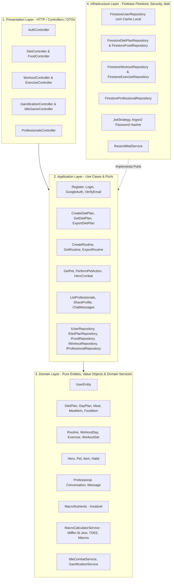
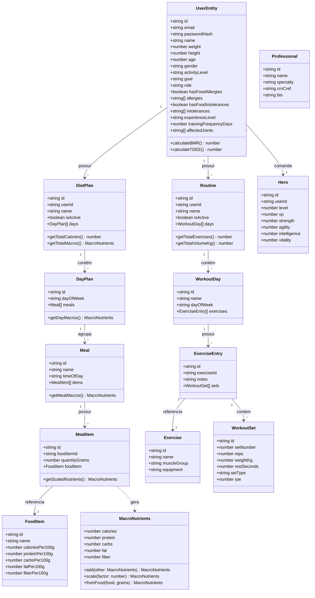
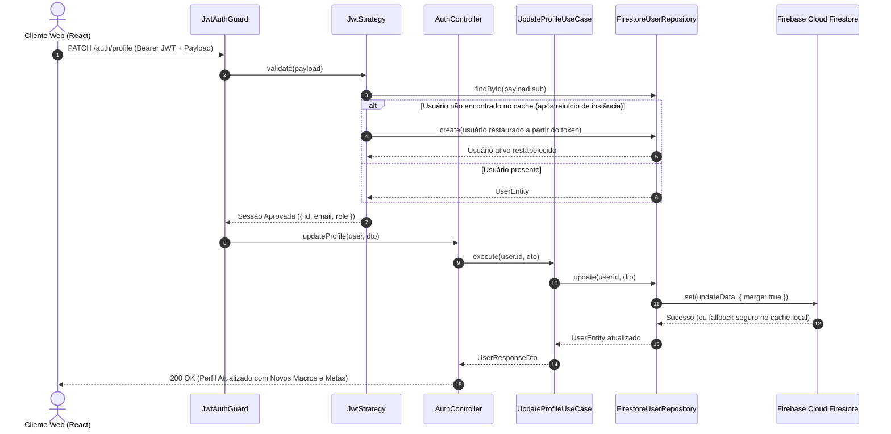
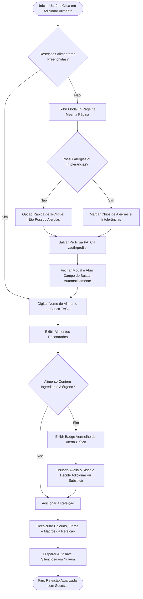

# Fase 3 — Análise, Arquitetura e Projeto
**Instituição:** FATEC Campinas  
**Curso:** Superior de Tecnologia em Análise e Desenvolvimento de Sistemas (ADS Noturno)  
**Disciplina:** LES — Laboratório de Engenharia de Software (2.2026)  
**Projeto:** NutriPlan — Sistema Integrado de Planejamento Nutricional, Periodização de Treino e Gamificação de Hábitos  
**Autor:** Gustavo Ruegenberg  
**Versão:** 2.0.0 — Outubro de 2026  

---

## 1. Definição Formal da Arquitetura

O sistema NutriPlan adota o padrão **Clean Architecture (Arquitetura Limpa / Ports & Adapters / Onion Architecture)** estruturado como um **Monólito Modular** no backend e uma **Single Page Application (SPA)** desacoplada no frontend.

A regra fundamental de dependência da Clean Architecture é rigorosamente preservada: **as dependências de código apontam exclusivamente para dentro, em direção às regras de negócio de mais alto nível**.



### 1.1 Responsabilidades de Cada Camada

1. **Domain Layer (`src/modules/*/domain/`):**
   - É o coração do sistema, contendo regras de negócio corporativas puras, entidades ricas, objetos de valor e serviços de domínio.
   - **Zero Dependências:** É totalmente agnóstica a bancos de dados, NestJS, Express ou qualquer biblioteca externa de infraestrutura.
2. **Application Layer (`src/modules/*/application/`):**
   - Contém os casos de uso (*Use Cases*) que orquestram o fluxo de execução das regras de negócio.
   - Declara as portas de entrada e saída (*Ports / Interfaces*) necessárias para que a infraestrutura forneça persistência e serviços de rede sem acoplamento direto.
3. **Infrastructure Layer (`src/modules/*/infrastructure/`):**
   - Implementa os adaptadores concretos para os repositórios (via **Firebase Cloud Firestore** com camada de cache resiliente em disco/memória), autenticação Passport JWT, hashing com Argon2id e envio de e-mails transacionais com a API Resend.
4. **Presentation Layer (`src/modules/*/presentation/`):**
   - Recebe as requisições HTTP, valida os dados de entrada através de **Data Transfer Objects (DTOs)** com anotações de `class-validator` e expõe a documentação OpenAPI/Swagger 3.0.

---

## 2. Justificativa dos Padrões Adotados (Design Patterns)

| Padrão de Projeto | Categoria | Onde foi aplicado no NutriPlan | Justificativa Técnica |
| :--- | :--- | :--- | :--- |
| **Repository** | Estrutural | `IUserRepository`, `IDietPlanRepository`, `IWorkoutRepository`, etc. | Isola o domínio do mecanismo de persistência (Firestore), permitindo testar as regras de negócio em milissegundos através de Mocks nos testes unitários. |
| **Value Object** | Tático (DDD) | `MacroNutrients` | Garante imutabilidade e encapsula regras de proporcionalidade e soma de nutrientes ($\text{calorias}, \text{proteínas}, \text{carboidratos}, \text{gorduras}, \text{fibras}$). |
| **Domain Service** | Tático (DDD) | `MacroCalculatorService`, `IdleCombatService` | Centraliza regras matemáticas e cálculos que não pertencem exclusivamente a uma entidade única (e.g. equações de Mifflin-St Jeor, TDEE, DRIs e combate). |
| **Data Transfer Object (DTO)** | Comportamental | `CreateDietPlanDto`, `UpdateProfileDto`, `RegisterDto` | Define contratos estritos de entrada/saída HTTP, sanitiza dados contra injeções maliciosas e alimenta o gerador automático do Swagger. |
| **Dependency Injection** | Criacional | IoC Container do NestJS via Tokens (`'USER_REPOSITORY'`, etc.) | Inverte as dependências, permitindo que os casos de uso recebam suas portas resolvidas em tempo de execução sem conhecer a infraestrutura. |
| **Strategy / Guard** | Estrutural | `JwtAuthGuard`, `JwtStrategy` | Intercepta requisições protegidas para autenticar e validar o payload criptográfico do token JWT de forma modular. |
| **Circuit Breaker / Fallback Cache** | Resiliência | Repositórios Firestore (`localUsersMap`, `local-cache/`) | Garante alta disponibilidade caso o banco em nuvem sofra oscilações ou o servidor opere em ambientes efêmeros (como Render Free Tier). |

---

## 3. Diagrama de Classes do Domínio (UML)



---

## 4. Diagramas Comportamentais

### 4.1 Diagrama de Sequência — Autenticação e Atualização Resiliente de Perfil



### 4.2 Diagrama de Atividades — Montagem de Dieta e Interceptação Preventiva de Alergias



---

## 5. Modelo Lógico de Dados (Coleções NoSQL - Firebase Firestore)

O NutriPlan utiliza uma modelagem orientada a documentos no **Firebase Cloud Firestore**, otimizada para leituras atômicas e renderização instantânea do plano alimentar completo:

### Coleção `users`
```json
{
  "id": "uuid-v4",
  "email": "atleta@nutriplan.app",
  "name": "Carlos Silva",
  "passwordHash": "$argon2id$v=19$...",
  "role": "USER",
  "isEmailVerified": true,
  "weight": 78.5,
  "height": 178,
  "age": 28,
  "gender": "MALE",
  "activityLevel": "MODERATE",
  "goal": "HYPERTROPHY",
  "hasFoodAllergies": true,
  "allergies": ["Amendoim", "Frutos do mar"],
  "hasFoodIntolerances": false,
  "intolerances": [],
  "experienceLevel": "INTERMEDIATE",
  "trainingFrequencyDays": 5,
  "hasJointPain": "YES",
  "affectedJoints": ["Ombro direito"],
  "createdAt": "2026-10-01T12:00:00Z",
  "updatedAt": "2026-10-02T15:30:00Z"
}
```

### Coleção `diet_plans`
```json
{
  "id": "uuid-v4",
  "userId": "uuid-user-v4",
  "name": "Hipertrofia Limpa - 2800 kcal",
  "isActive": true,
  "days": [
    {
      "id": "uuid-day-1",
      "dayOfWeek": "MONDAY",
      "meals": [
        {
          "id": "uuid-meal-1",
          "name": "Café da Manhã",
          "items": [
            {
              "id": "uuid-item-1",
              "foodItemId": "taco-ovo-cozido",
              "foodName": "Ovo de galinha cozido",
              "quantityGrams": 150,
              "unit": "un",
              "quantityValue": 3
            }
          ]
        }
      ]
    }
  ],
  "updatedAt": "2026-10-02T15:30:00Z"
}
```

### Coleção `routines`
```json
{
  "id": "uuid-v4",
  "userId": "uuid-user-v4",
  "name": "Push / Pull / Legs",
  "isActive": true,
  "days": [
    {
      "id": "uuid-routine-day-1",
      "name": "Treino A - Peito, Ombro e Tríceps",
      "dayOfWeek": "MONDAY",
      "exercises": [
        {
          "id": "uuid-ex-entry-1",
          "exerciseId": "supino-reto-barra",
          "notes": "Foco na fase excêntrica de 3 segundos",
          "sets": [
            { "setNumber": 1, "reps": 10, "weightKg": 80, "restSeconds": 90, "setType": "NORMAL", "rpe": 8 }
          ]
        }
      ]
    }
  ]
}
```

---

## 6. Planejamento de Testes e Estratégia de Integração

A estratégia de testes do NutriPlan adota a **Pirâmide de Testes Tradicional da Engenharia de Software**:

1. **Testes Unitários (Base da Pirâmide):**
   - Foco em funções matemáticas puras, Value Objects e Use Cases isolados.
   - Execução via **Vitest** com emulação de módulos e injeção de dependências falsas (Spies/Mocks).
   - Meta estabelecida de cobertura: $\ge 70\%$ nas camadas de Domínio e Casos de Uso.
2. **Testes de Integração:**
   - Validação dos Pipes de validação (`ValidationPipe`), decoradores personalizados e compatibilidade entre DTOs e entidades.
   - Teste de integração de repositórios com mecanismo de cache local de contingência.
3. **Estratégia de Integração Contínua (CI/CD):**
   - Todo commit enviado ao branch `main` executa a compilação completa do TypeScript e roda a bateria de testes automatizados antes de acionar o deploy automático no servidor de produção Render.
