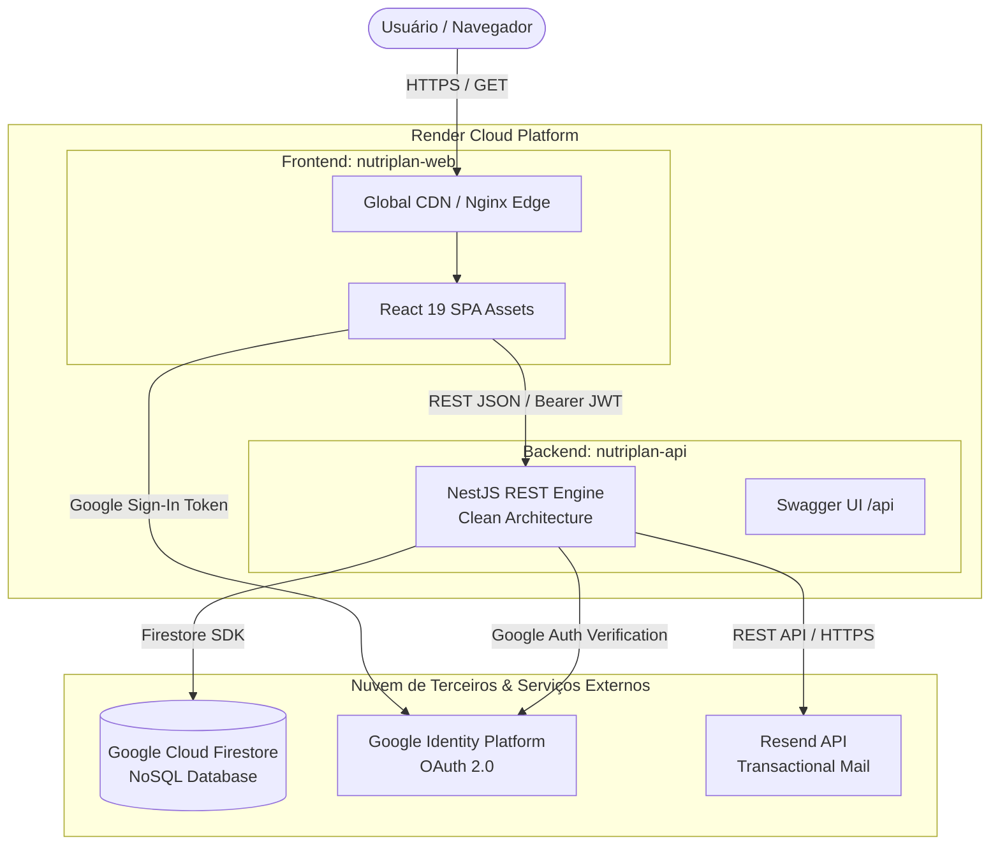

# Fase 5 — Implantação e Encerramento
**Projeto:** NutriPlan — Sistema Integrado de Nutrição, Treino e Gamificação RPG  
**Instituição:** FATEC Campinas — Curso Superior de Tecnologia em Análise e Desenvolvimento de Sistemas (5º ADS Noturno - 2.2026)  
**Disciplina:** Laboratório de Engenharia de Software (LES)  
**Versão:** 2.0.0 — 2026-10-02  

---

## 1. Plano de Implantação (Deployment Plan)

### 1.1 Topologia de Implantação em Nuvem (Render Cloud Blueprint)

O **NutriPlan** foi projetado para operar em nuvem moderna através da infraestrutura como código (IaC) com o arquivo declarativo [render.yaml](file:///C:/Users/Gustavo/Projetos/nutriplan/render.yaml), que provisiona e orquestra automaticamente dois serviços gerenciados interconectados:

1. **Backend Web Service (`nutriplan-api`):**
   - **Runtime:** Node.js (versão 22+).
   - **Build Command:** `npm install && npm run build`.
   - **Start Command:** `npm run start:prod`.
   - **Persistência Externa:** Google Firebase Cloud Firestore (NoSQL gerenciado) com fallback resiliente para cache local em disco.
   - **Serviço de Correio Transacional:** Resend API (para envio seguro de e-mails de validação de conta).

2. **Frontend Static Site (`nutriplan-web`):**
   - **Runtime:** Static Site Hosting com CDN global.
   - **Build Command:** `npm install && npm run build`.
   - **Publish Directory:** `dist`.
   - **Roteamento SPA:** Regra de reescrita automática de rotas (`/* -> /index.html`) para suporte completo ao client-side routing do React Router.
   - **Injeção de Ambiente:** Vinculação automática da variável `VITE_API_URL` à URL pública gerada pelo serviço da API (`RENDER_EXTERNAL_URL`).

### 1.2 Alternativa de Containerização Local (Docker & Docker Compose)

Para execução local ou em servidores dedicados (VPS), o projeto conta com os arquivos [docker-compose.yml](file:///C:/Users/Gustavo/Projetos/nutriplan/docker-compose.yml), [api/Dockerfile](file:///C:/Users/Gustavo/Projetos/nutriplan/api/Dockerfile) e [web/Dockerfile](file:///C:/Users/Gustavo/Projetos/nutriplan/web/Dockerfile) empregando imagens multi-estágio (*multi-stage build*) baseadas em Alpine Linux:

- **Build de Produção Backend:** Compila TypeScript em ambiente isolado e copia apenas os artefatos `dist` e dependências essenciais de produção para a imagem final runner.
- **Build de Produção Frontend:** Compila os assets estáticos via Vite e entrega a aplicação através de um servidor Nginx Alpine com regras de fallback SPA configuradas.

### 1.3 Pipeline de CI/CD (Continuous Integration & Continuous Deployment)

A esteira de entrega contínua do projeto é disparada automaticamente a cada push na ramificação `main` do GitHub:
1. **Gatilho de Evento:** `git push origin main`.
2. **Integração Contínua (CI):**
   - Resolução e instalação limpa de dependências (`npm ci`).
   - Análise estática e checagem de tipos (`npm run build`).
   - Execução de toda a suíte de testes unitários no Vitest (`npm test`).
3. **Implantação Contínua (CD):**
   - O Render detecta o commit na branch `main`, reconstrói o container da API e gera os assets otimizados do frontend.
   - Aplica migração/inicialização transparente sem tempo de inatividade para os usuários (*zero-downtime deployment*).

### 1.4 Matriz de Variáveis de Ambiente de Produção

| Variável | Contexto | Obrigatória? | Descrição |
| :--- | :--- | :--- | :--- |
| `PORT` | API | Sim | Porta de escuta HTTP (padrão: `3000`). |
| `JWT_SECRET` | API | Sim | Chave criptográfica para assinatura dos tokens JWT. |
| `JWT_EXPIRES_IN` | API | Sim | Tempo de validade do token (configurado para `30d` para evitar quedas prematuras de sessão). |
| `FIREBASE_SERVICE_ACCOUNT` | API | Opcional | Credencial de conta de serviço em JSON base64 para acesso ao Firestore em nuvem. Na ausência, a API ativa cache resiliente em disco. |
| `RESEND_API_KEY` | API | Opcional | Chave de integração para disparo de e-mails transacionais de ativação de conta. |
| `VITE_API_URL` | Web | Sim | URL base do backend NestJS (injetada automaticamente pelo Render). |
| `VITE_GOOGLE_CLIENT_ID` | Web | Opcional | ID de cliente OAuth 2.0 do Google Cloud Console para ativação do botão de Login com Google. |

### 1.5 Roteiro de Homologação e Execução (Smoke Testing)

Para avaliação rápida no ambiente do usuário ou avaliador:

1. **Execução Local Automatizada (1 Clique no Windows):**
   - Executar o script [iniciar-tudo.bat](file:///C:/Users/Gustavo/Projetos/nutriplan/iniciar-tudo.bat) na raiz do projeto.
   - O script inicializa a API na porta `3000`, o frontend web na porta `5173` e abre o navegador automaticamente em `http://localhost:5173`.
2. **Execução da Bateria de Testes:**
   - Executar o script [executar-testes.bat](file:///C:/Users/Gustavo/Projetos/nutriplan/executar-testes.bat) ou executar `npm test` dentro de `api`.
   - Constatar a passagem dos 52 testes automatizados em 11 arquivos de teste.
3. **Inspeção de Contratos e Swagger OpenAPI:**
   - Acessar `http://localhost:3000/api` para interagir com os endpoints documentados.

---

## 2. Documentos e Manuais de Apoio

A documentação operacional e técnica completa do sistema está estruturada nos seguintes manuais:

- 📖 **[Manual do Usuário](file:///C:/Users/Gustavo/Projetos/nutriplan/docs/manual-do-usuario.md):** Guia prático passo a passo com telas, orientações para preenchimento de anamnese clínica, montagem de planos alimentares com detecção de alérgenos, periodização de treinos com filtro de lesões, acompanhamento de hidratação diária, jogo RPG NutriHero e agendamento de consultas com profissionais de saúde.
- ⚙️ **[Manual Técnico](file:///C:/Users/Gustavo/Projetos/nutriplan/docs/manual-tecnico.md):** Manual aprofundado para engenheiros de software e avaliadores técnicos, contendo detalhamento das 4 camadas da Clean Architecture, repositórios Firestore, fluxo de autenticação e catálogo completo de rotas da API REST.

---

## 3. Relatório Final de Encerramento do Projeto

### 3.1 Análise Crítica do Processo de Desenvolvimento

A metodologia de **Scrum Adaptado / Desenvolvimento Incremental** mostrou-se indispensável para a viabilização do projeto no prazo acadêmico de 10 semanas. A estruturação do trabalho em 5 sprints temáticos com entregáveis funcionais em cada ciclo possibilitou:

- **Evolução Gradativa e Controlada:** A maturidade do software cresceu de forma contínua, partindo de um núcleo seguro de domínio e cálculos clínicos no Sprint 1 até as integrações ricas de gamificação e teleorientação profissional nos Sprints 4 e 5.
- **Isolamento de Domínios:** Cada módulo do sistema (`auth`, `diet`, `workout`, `gamification`, `professionals`) foi concebido como um subdomínio desacoplado, o que minimizou o efeito cascata de eventuais alterações.
- **Rastreabilidade Bidirecional:** A correspondência rigorosa entre os Requisitos Funcionais (RF01 a RF24), os testes automatizados (52 testes Vitest) e os endpoints documentados no Swagger assegurou cobertura total do escopo acordado sem funcionalidades fantasmas ou código inerte.

### 3.2 Principais Dificuldades Encontradas e Soluções Adotadas

1. **Gestão de Sessão e Inatividade de Contêineres Gratuitos em Nuvem:**
   - *Desafio:* Em plataformas de hospedagem em nuvem que entram em suspensão (*spin-down*) por inatividade, o uso de tokens JWT de curta duração (15 minutos) causava deslogues frequentes e indesejados, frustrando a experiência do usuário durante o uso diário.
   - *Solução Aplicada:* Implementou-se uma política de sessão estendida para **30 dias** (`JWT_EXPIRES_IN=30d`), aliada a interceptores resilientes no frontend Axios e rotinas de proteção de dados no `AuthContext` (armazenando cópia sanitizada do perfil para garantir persistência offline do usuário).

2. **Alta Disponibilidade e Resiliência de Persistência:**
   - *Desafio:* A dependência de chaves de serviço do Google Cloud Firestore em ambientes de testes e homologação local frequentemente impedia a execução por terceiros ou avaliadores sem credenciais configuradas.
   - *Solução Aplicada:* Desenvolveu-se um padrão de repositório resiliente com camada de cache local (*local-disk fallback*). Caso as credenciais em nuvem estejam ausentes, a API opera perfeitamente gravando e lendo registros em estruturas JSON locais, sem interromper nenhuma operação do sistema.

3. **Complexidade de Experiência do Usuário (UX) na Montagem de Dietas:**
   - *Desafio:* No fluxo inicial, ao tentar incluir o primeiro alimento em uma dieta, o sistema exigia o preenchimento de restrições alimentares forçando a saída da tela e o redirecionamento para o perfil geral, interrompendo o foco do usuário.
   - *Solução Aplicada:* Construiu-se um diálogo modal integrado diretamente na tela de planejamento alimentar (`DietaryRestrictionsModal`), permitindo responder às perguntas de restrições em segundos e prosseguir imediatamente com a adição do alimento desejado.

4. **Redundância de Campos Clínicos na Anamnese:**
   - *Desafio:* A coexistência de perguntas distintas para "tempo de prática" e "nível de experiência" gerava confusão e retrabalho para o usuário final.
   - *Solução Aplicada:* Unificou-se os dados em um seletor único e abrangente no cadastro antropométrico, simplificando a interface sem prejuízo para a prescrição biomecânica.

### 3.3 Melhorias Implementadas Durante o Ciclo de Vida

- **Remoção Estratégica de Funcionalidades Não Essenciais (CR-01):** Decisão formal de retirar o módulo de artigos científicos secundários para concentrar todos os esforços de engenharia na experiência central de nutrição, periodização de treino, hidratação e acompanhamento profissional.
- **Gamificação NutriHero RPG & Mascote NutriPet:** Transformação de tarefas tradicionalmente cansativas (registrar ingestão de água e refeições) em gatilhos de engajamento lúdico, com evolução de personagem, combate contra vilões ultraprocessados e recompensas diárias.
- **Segurança de Acesso e Multi-Provider:** Suporte transparente tanto a login tradicional via e-mail e senha com Argon2id e validação por Resend, quanto a login ágil via Google OAuth 2.0.

### 3.4 Lições Aprendidas e Trabalhos Futuros

#### Lições Aprendidas:
- **Clean Architecture Viabiliza Mudanças Ágeis:** O desacoplamento estrito entre as regras de negócio de domínio e as tecnologias de infraestrutura permitiu alterar estratégias de banco e persistência sem precisar reescrever nenhuma linha dos casos de uso ou cálculos nutricionais.
- **Testes Automatizados como Documentação Viva:** Os 52 testes unitários do Vitest serviram não apenas como rede de proteção contra regressões, mas como a especificação mais fidedigna do comportamento do sistema.

#### Trabalhos Futuros:
1. **Publicação Mobile Nativa:** Empacotamento do frontend React via Capacitor com publicação das compilações nas lojas Google Play Store e Apple App Store.
2. **Integração com Wearables de Saúde:** Sincronização automática de passos diários, gasto calórico ativo e ingestão de água através das APIs do Google Health Connect e Apple HealthKit.
3. **Assistência com Inteligência Artificial Generativa:** Implementação de agente inteligente para recomendação automática de receitas e substituições alimentares equivalentes em macronutrientes com base na Tabela TACO.
