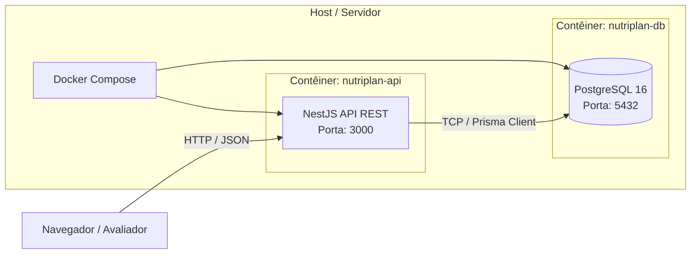

# Fase 5 — Implantação e Encerramento
**Projeto:** NutriPlan — Sistema de Planejamento de Dieta, Treino e Educação Científica  
**Versão:** 1.0.0 — 2026-09-01  

---

## 1. Plano de Implantação (Deployment Plan)

### 1.1 Topologia de Implantação (Docker Multi-Stage)

O sistema foi containerizado em contêineres Docker independentes orquestrados via **Docker Compose**:
- **Serviço de Banco de Dados:** `postgres:16-alpine` com volume persistente para dados e checagem de integridade (*healthcheck* ativo).
- **Serviço da API:** Imagem otimizada Node.js 24 Alpine construída em múltiplos estágios (*multi-stage build*), executando migrações automáticas do Prisma antes da inicialização do servidor.



### 1.2 Roteiro de Execução para Produção / Avaliação

1. **Clonagem e Configuração:**
   ```bash
   git clone <url-repositorio> nutriplan
   cd nutriplan/api
   cp .env.example .env
   ```
2. **Subida dos Contêineres:**
   ```bash
   docker-compose up -d --build
   ```
3. **Execução de Migrações e Seed Inicial:**
   ```bash
   npx prisma migrate dev --name init
   npx ts-node prisma/seed.ts
   ```
4. **Acesso e Verificação (Smoke Testing):**
   - API e Documentação Swagger: `http://localhost:3000/api`
   - Teste de Saúde: `GET http://localhost:3000/auth/profile`

---

## 2. Relatório Final de Encerramento

### 2.1 Análise Crítica do Processo Adotado

A escolha do **Processo Incremental com práticas Ágeis (Scrum Adaptado)** demonstrou-se altamente eficaz para o contexto de um desenvolvedor solo com prazo de 10 semanas. A divisão em 4 sprints temáticos (Auth, Dieta, Treino, Educacional) permitiu:
- Foco delimitado em cada domínio de negócio sem sobrecarga cognitiva.
- Validação precoce da arquitetura Clean Architecture no Sprint 1, evitando refatorações estruturais tardias.
- Cobertura de testes unitários construída concomitantemente à implementação dos casos de uso, e não como tarefa residual.

### 2.2 Principais Dificuldades Encontradas

1. **Gestão de Dependências de Versões Novas:** O lançamento recente de versões release candidate de ferramentas (Prisma Platform CLI v8) gerou inconsistências de geração de tipos, superadas prontamente pelo retorno à versão LTS estável (Prisma 5.22).
2. **Complexidade de Modelagem Relacional N:N:** A estrutura hierárquica de `DietPlan` $\rightarrow$ `DayPlan` $\rightarrow$ `Meal` $\rightarrow$ `MealItem` e `Routine` $\rightarrow$ `WorkoutDay` $\rightarrow$ `ExerciseEntry` $\rightarrow$ `WorkoutSet` exigiu atenção rigorosa ao isolamento de entidades de domínio para evitar acoplamento a modelos do ORM.

### 2.3 Melhorias Implementadas Durante o Ciclo

- Criação de um Value Object imutável (`MacroNutrients`) com métodos encapsulados de soma e escala, eliminando cálculos soltos e código duplicado.
- Carga de dados inicial (Seed) automatizada com 75 alimentos brasileiros da Tabela TACO e 48 exercícios catalogados, dispensando cadastro manual pelo usuário avaliador.
- Capacidade nativa de importação e exportação de planos em formato JSON com validação profunda de integridade.

### 2.4 Lições Aprendidas

- **Arquitetura Limpa Compensa o Esforço Inicial:** Embora exija mais arquivos (Entities, Ports, Use Cases, Repositories, DTOs, Controllers), a clareza e facilidade de teste unitário compensam amplamente a verbosidade.
- **Rastreabilidade Guia a Qualidade:** Manter a matriz de rastreabilidade alinhada aos testes garante que nenhum requisito funcional seja esquecido ou fique sem evidência de teste.
